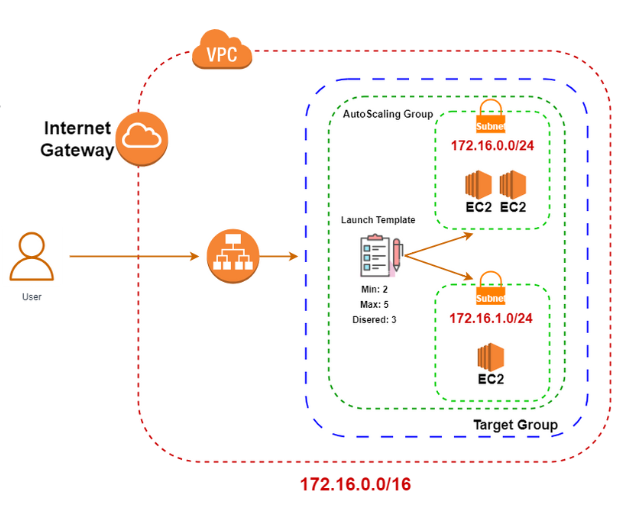

# Deployment Documentation: Dockerized Application Monitored on AWS with Terraform

## 1. Introduction
The implemented application is a simple Hello World, containerized with Docker and deployed on AWS. It was designed to demonstrate the integration of various modern technologies for building and deploying scalable and resilient infrastructures. The provisioning process for the entire infrastructure has been automated using Terraform, which allows the creation, management, and modification of infrastructure as code.

### Technologies Used
- **AWS**: Cloud infrastructure.
- **Terraform**: Tool for provisioning infrastructure as code.
- **Docker**: Containerization of the application.
- **CloudWatch**: Monitoring of the application and infrastructure.
- **SNS (Simple Notification Service)**: Notification system for alerts.
- **Application Load Balancer (ALB)**: Load balancing.
- **Auto Scaling Group (ASG)**: Automatic scaling of EC2 instances.

## 2. Technologies and Architecture Implemented

### 2.1 Network (VPC and Subnets)
The network infrastructure was organized within a **VPC (Virtual Private Cloud)** with the following configurations:
- **VPC (rte-wk6-vnet)** with CIDR `172.16.0.0/16`.
- **Public Subnets** distributed across the availability zones (AZs) `us-east-1a` and `us-east-1b`.
- **Internet Gateway** associated with the VPC to allow communication with the internet.

### 2.2 Security
The application’s security is ensured with two main security groups:
- **rte-wk6-alb-security-group**: Controls incoming traffic to the Load Balancer.
- **rte-wk6-asg-security-group**: Defines traffic rules for the application instances.

### 2.3 Load Balancing
**Application Load Balancer (ALB)**: Receives HTTP requests on port 80 and distributes traffic to the EC2 instances.
- **Target Group**: Monitors the health of the EC2 instances and ensures that traffic is directed only to healthy instances.

### 2.4 Auto Scaling
**Auto Scaling Group (ASG)**: Automatically adjusts the number of EC2 instances based on demand. The current configuration defines a desired number of 3 instances, with a minimum of 2 and a maximum of 5 instances.
- **Launch Template**: Defines the configuration of EC2 instances, including instance type (`t2.micro`) and AMI (`ami-006dcf34c09e50022`).

### 2.5 Monitoring and Alerts
- **CloudWatch Dashboard**: Provides real-time metrics on Load Balancer traffic, CPU utilization, and EC2 instance response time.
- **CloudWatch Alarms**: Monitors the health of instances and sends notifications via SNS if any alarms are triggered.

## 3. User Flow to the Application
1. The user accesses the application via a browser (HTTP request on port 80).
2. The **Load Balancer (ALB)** receives the traffic and forwards it to an active EC2 instance in the **Target Group**.
3. The EC2 instance processes the request and returns the response to the ALB.
4. The ALB forwards the response back to the client.
5. If demand increases, the **Auto Scaling Group** automatically creates new EC2 instances to ensure the application continues running without interruptions.

## 4. Repository Implementation Guide
This guide describes the steps to implement and manage the infrastructure using Terraform. Below, you will find instructions for setting up the backend, creating AWS resources, and using remote state.

### 4.1 Environment Setup
Before you begin, make sure that Terraform is installed and properly configured in your environment.

#### 4.1.1 Install Terraform
Follow the instructions in the official documentation to install Terraform.

#### 4.1.2 AWS Configuration
Configure your AWS credentials by running `aws configure` or by setting the `~/.aws/credentials` file.

### 4.2 Creating Initial Infrastructure (Bucket and DynamoDB)

#### 4.2.1 Local Backend Setup
First, you need to configure the backend to use the S3 Bucket and DynamoDB table to store the remote state of Terraform. This is done in the `backend.tf` file.

The backend will be set up with a private, versioned S3 bucket, with an expiration policy for older objects.
The DynamoDB table will be set up to lock the remote state and avoid simultaneous access to the state.

#### 4.2.2 Running terraform init
After setting up the backend, run the `terraform init` command to initialize Terraform. This command sets up the environment, configures remote state, and prepares the required resources.

### 4.3 Defining IAM Role

#### 4.3.1 Creating IAM Role and Policy
The next step is to create the IAM role and associate the CloudWatch access policy. This is done in the `iam_role.tf` file.

The file defines the IAM policy that allows access to CloudWatch and other necessary resources.
The policy is then attached to the role, enabling AWS resources to interact with CloudWatch.

#### 4.3.2 Running terraform apply
After configuring the IAM role, run the `terraform apply` command to apply the configuration. This will create the IAM role and the attached policy.

### 4.4 Defining Other Infrastructure Resources
After setting up the S3 bucket, DynamoDB, and IAM role, you can define and apply other infrastructure modules such as VPC, security, load balancers, auto-scaling groups, and more. These resources will be defined in separate files such as `vpc.tf` for creating a VPC.

In the `vpc.tf` file, you will define the settings for the VPC, public subnets, route tables, internet gateways, etc.
This file may also include other network definitions such as security groups and load balancing.

#### Next Steps:
After setting up the objects in the S3 bucket for permissions and policies with the `iam_role.tf`, the next step is to define and configure the `provider.tf` file. This file will be the main object where the provider is configured to manage all states when we run `terraform apply` on the `main.tf` application.

## 5. Technical Details about the Code

### 5.1 Auto Scaling Group (ASG)
The **Auto Scaling Group (ASG)** ensures that the number of EC2 instances is dynamically adjusted according to the application load. The ASG configuration is detailed as follows:
- **desired_capacity**: The desired number of instances (3 instances).
- **max_size**: Maximum number of instances (5 instances).
- **min_size**: Minimum number of instances (2 instances).
- **target_group_arns**: Associates the EC2 instances with the ALB Target Group.
- **launch_template**: Defines the launch template for instances, including AMI and instance type.

### 5.2 Launch Template
The **Launch Template** defines the configuration needed to launch EC2 instances. The configurations include:
- **image_id**: The AMI used to create EC2 instances (`ami-006dcf34c09e50022`).
- **instance_type**: Instance type (`t2.micro`).
- **user_data**: A script that is automatically executed when the instance starts, which installs Docker, configures the environment, and runs the application within a Docker container.

### 5.3 Health Checks
The **Target Group** associated with the ALB performs periodic health checks on EC2 instances:
- The instance is considered healthy if the health URL (`/health`) returns an HTTP 200 status.
- If an instance fails the Health Check, traffic is redirected to another healthy instance.

## 6. Provisioning and Execution Flow

### 6.1 Creation of EC2 Instances
1. The **Auto Scaling Group** starts the creation of instances according to the **Launch Template**.
2. The **Launch Template** uses **user_data**, which executes a bash script to set up Docker and start the application inside a Docker container.

### 6.2 Scalability and Monitoring
1. If the load increases, the **Auto Scaling Group** scales automatically to create new instances.
2. **CloudWatch** monitors resource utilization and sends alerts via SNS if configured limits are exceeded.

## 7. Conclusion
The infrastructure was implemented in a modular and scalable manner, ensuring high availability and the ability to respond to demand spikes. Using **Terraform** for provisioning, **Docker** for containerization, and **AWS** for infrastructure management, the application can operate efficiently and be easily scaled as needed.

Continuous monitoring through **CloudWatch** and the **Health Checks** implemented in the ALB ensure that the application instances are always available and functioning properly, with alerts configured to notify about any infrastructure failures.
